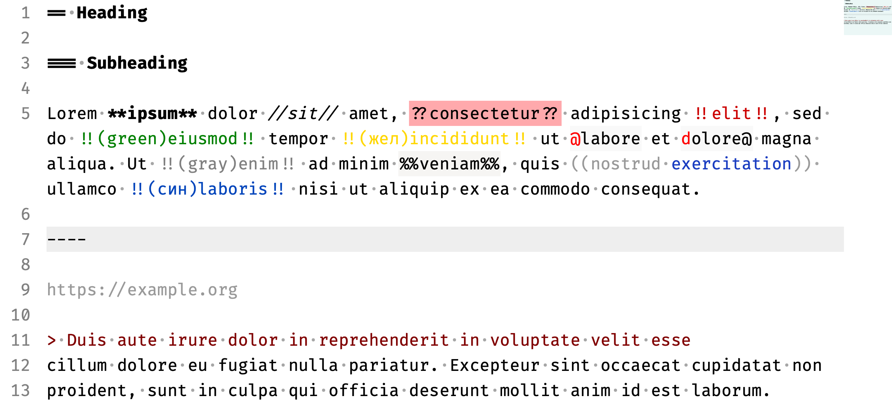

# Yandex Wiki

Sublime Text syntax support for [Yandex Wiki](https://yandex.ru/support/connect-wiki/static-markup.html?lang=en).

## Installation

The preferred method of installation is via [Sublime Package Control][package-control]. Package Control automatically download the package and keeps it up-to-date.

1. [Install Package Control][install-package-control].
1. From inside Sublime Text, open Package Control's Command Pallet: <kbd>Ctrl + Shift + P</kbd> (Windows, Linux) or <kbd>Cmd ⌘ + Shift ⇧ + P</kbd> on Mac.
1. Type `install package` and hit Return. A list of available packages will be displayed.
1. Type `YandexWiki` and hit Return. The package will be downloaded to the appropriate directory.

[package-control]: https://packagecontrol.io/
[install-package-control]: https://packagecontrol.io/installation

## Features

Syntax highlighting:

* headings
* bold, italic, questions, colored remarks, underline, strikethrough
* inline code & block (using `%%`)
* logins (@xxx, xxx@, кто:xxx, etc)
* inline quote
* horizontal line

Hotkeys to wrap selection:

* <kbd>*</kbd> — bold (`**selection**`)
* <kbd>/</kbd> — italic (`//selection//`)
* <kbd>?</kbd> — question (`??selection??`)
* <kbd>!</kbd> — remark (`!!selection!!`)
* <kbd>%</kbd> — code (`%%selection%%`)

## Resources

* Sublime Docs: [color scheme](https://www.sublimetext.com/docs/3/color_schemes.html), [syntax matching](http://www.sublimetext.com/docs/3/syntax.html).
* [PackageControl page](https://packagecontrol.io/packages/YandexWiki).
* [PackageControl definition](https://github.com/wbond/package_control_channel/blob/35c865ab30bf4c425a29dac8a6c4e72e3e3b44d8/repository/y.json#L47-L57) (as of 19 Mar 2019).
* [Yandex Wiki for Visual Studio Code](https://github.com/rusnasonov/vscode-yandex-wiki)
